<div align="center">

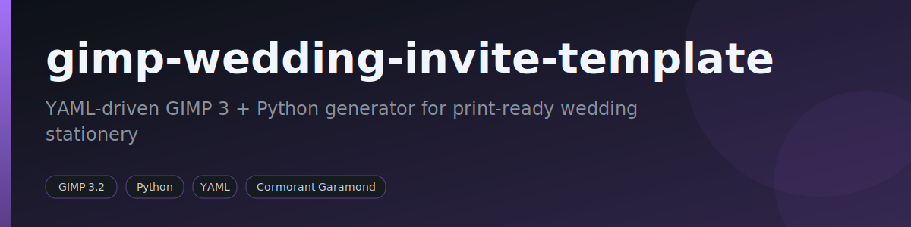

[](LICENSE) [](https://www.python.org/) [](#requirements) [](https://www.gimp.org/)

</div>

> YAML-driven GIMP 3 + Python generator for print-ready wedding stationery.

Per-deliverable wedding-stationery generator using **GIMP 3.2 + Python (GObject Introspection)**, driven by an interactive TUI. Each *delivery module* under `modules/` owns its own layout, content, and build script, and produces print-ready PNG + PDF artifacts via `gimp-console-3.2.exe`.

## Table of Contents

- [Features](#features)
- [Modules](#modules)
- [How it works](#how-it-works)
- [Examples](#examples)
- [Requirements](#requirements)
- [Usage](#usage)
- [Customization](#customization)
- [Project structure](#project-structure)
- [Adding a new module](#adding-a-new-module)
- [Fonts](#fonts)
- [Tests](#tests)
- [License](#license)

## Features

- **YAML-driven content + layout** — text lives in `content.yaml`, geometry in `layout.yaml`; shared GIMP primitives live in `src/`.
- **Interactive TUI** (`tui.py` / `run.ps1`) that walks every field in `content.yaml` and prompts for each (Enter keeps the default), or runs `--non-interactive` from defaults.
- **Multiple delivery modules** — single-page invite, tri-fold wedding-sponsor manuals (bridesmaid / groomsman / couple), and tri-fold kids manuals (page boy / flower girl).
- **Print-ready output** — each run emits an editable `.xcf`, a 300 DPI `.png` preview, and a native-size `.pdf`; tri-fold modules also emit a landscape print PDF imposed on the chosen paper (`*_a4.pdf` / `*_letter.pdf`) with equal 5 mm margins and fold marks.
- **Selectable paper (A4 / US Letter)** — set `paper: a4` or `paper: letter` in `content.yaml`; the canvas is sized to that sheet's printable area, so margins, text wrap and vertical distribution adapt automatically.
- **Build checklist** — the TUI lets you tick which variants of a module to build (all of them or just a few), or pass `--variants bridesmaid,couple`.
- **Evenly-distributed panels** — every block is measured and spaced evenly between the top and bottom margins, so panels stay balanced regardless of text length.
- **Reproducible runs** — every run snapshots its exact `_content.yaml` / `_layout.yaml` (plus JSON bridges) into `outputs/<run>/`.
- **Committed English-placeholder templates** — `template/template*.{png,pdf,xcf}` ship as canonical examples; real names/venues are supplied per run and never committed.
- **Batch mode** — `--all` rebuilds every active module in one GIMP session (one startup instead of N).
- **Cormorant Garamond** typography with a Georgia fallback.

## Modules

| Module               | Status | Output                                                                     |
|----------------------|--------|----------------------------------------------------------------------------|
| `wedding-invite`     | active | 1 portrait page (5×7" @ 300 DPI)                                           |
| `wedding-sponsors` | active | 3 tri-fold variants (bridesmaid / groomsman / couple), 2 sides → 6 XCFs (A4-landscape, 28.7×20 cm) |
| `wedding-menu`       | TODO   | reception menu card (stub)                                                 |
| `wedding-juniors`      | active | 2 tri-fold variants (page boy / flower girl), 2 sides → 4 XCFs (A4-landscape, 28.7×20 cm) |

The TUI auto-discovers any directory under `modules/` that has all three of `build.py`, `layout.yaml`, and `content.yaml`; those are listed as **active**. A directory missing them (e.g. `wedding-menu`) is shown as a TODO stub and skipped by `--all`.

The `wedding-sponsors` module builds all three wedding-sponsor manuals in a single run. They share the common externo + mission + tips blocks via `src/trifold_blocks.py`; only the middle interno panel differs per variant (single-role center for bridesmaid / groomsman, split center for couple). Per-variant cover/role data lives under `variants:` in `content.yaml`, and `layout.yaml` splits `interno.middle` into `single:` / `split:` sub-maps.

`wedding-juniors` reuses the same tri-fold engine for the kids — `pageboy` / `flowergirl`, both single-role — with a playful tone: a per-variant invite (`mission`), an outfit instruction (`role`), the palette swatches, kid icons (teddy / car / balloons), and an optional cover illustration slot at `assets/kids/<name>.png`.

Active modules ship a committed `template/template*.{png,pdf,xcf}` rendered with **English placeholder text** of similar letter-count to the Portuguese original, so the layout stays stable when real names/venues are plugged in via the TUI. The committed templates carry **placeholders only** (no real names/contact); real content is supplied per run and never committed.

## How it works

Each module pairs a `content.yaml` (text) with a `layout.yaml` (geometry) and a `build.py`. The TUI loads them, optionally prompts for field overrides and a background image, snapshots the merged content/layout to JSON, and dispatches into GIMP. Inside the `gimp-console-3.2.exe` session `src/module_runner.py` imports the chosen module's `build.py`, which composes panels from the shared `src/` primitives and saves an `.xcf`; the runner then re-loads each XCF, flattens it, and writes the PNG + PDF (plus an A4 PDF for tri-fold modules).

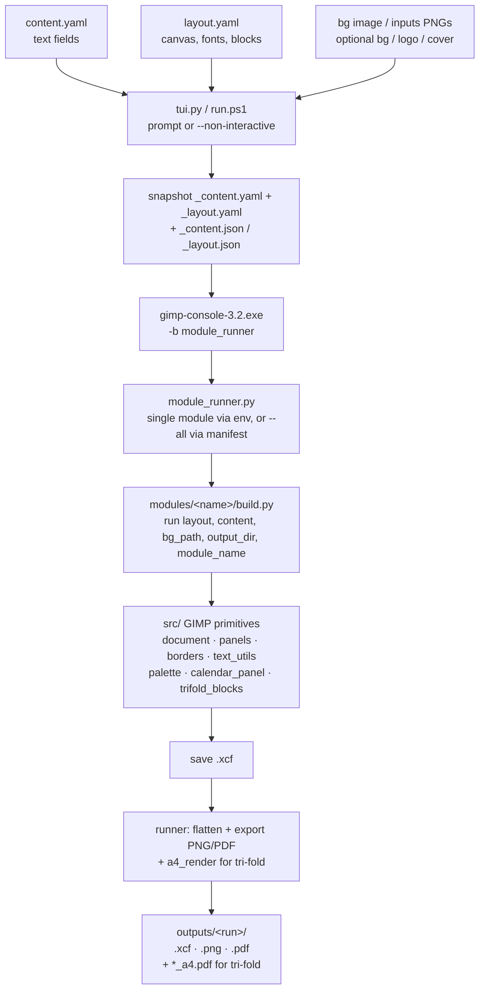

### Module contract

Every `modules/<name>/build.py` exports a single function:

```python
def run(layout, content, bg_path, output_dir, module_name) -> list[str]:
    """Build the deliverable. Return the list of saved .xcf paths.

    The generic runner re-loads each XCF, flattens it, and saves PNG + PDF
    alongside (and an A4 PDF for tri-fold modules).
    """
```

A module that produces multiple files (e.g. `wedding-sponsors` builds three variants × externo + interno sides) returns multiple XCF paths. Tri-fold modules set a `fold:` block in `layout.yaml`, which the runner uses to also emit the A4-landscape PDF via `src/a4_render.py`.

## Examples

All renders below are the committed `template/` files — **English placeholder content**; real names/contact are supplied per run and never committed. Every variant has two sides: **externo** (folded cover + monogram + calendar/ceremony) and **interno** (mission + role + tips).

### Wedding sponsors — `wedding-sponsors`

**Couple** (`couple`, split interno):

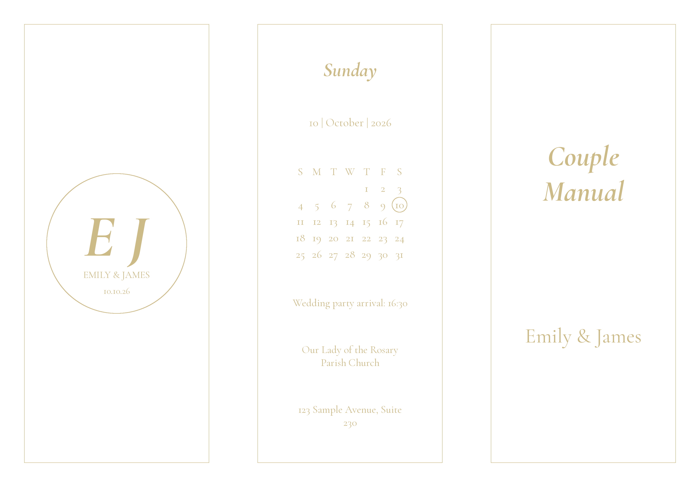
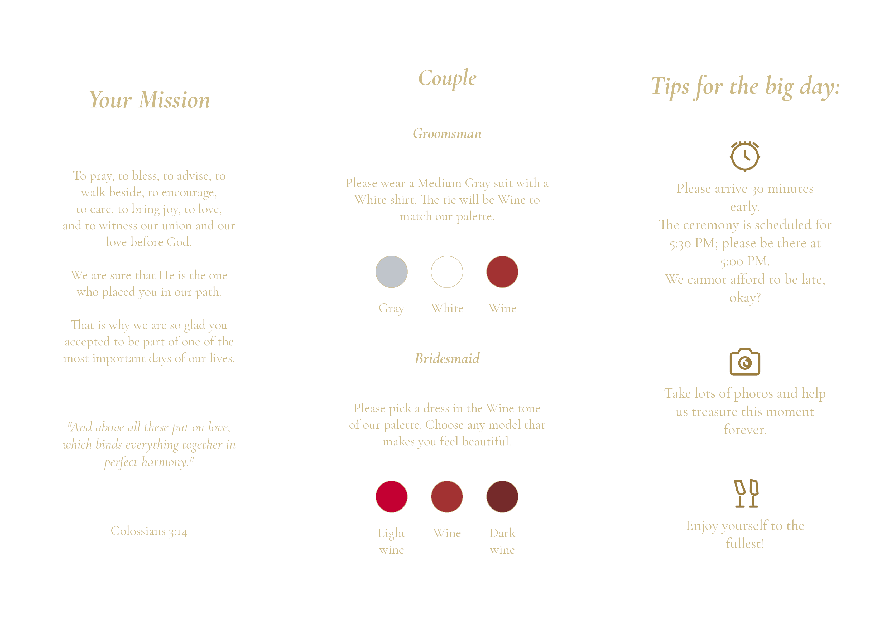

**Bridesmaid** (`bridesmaid`):

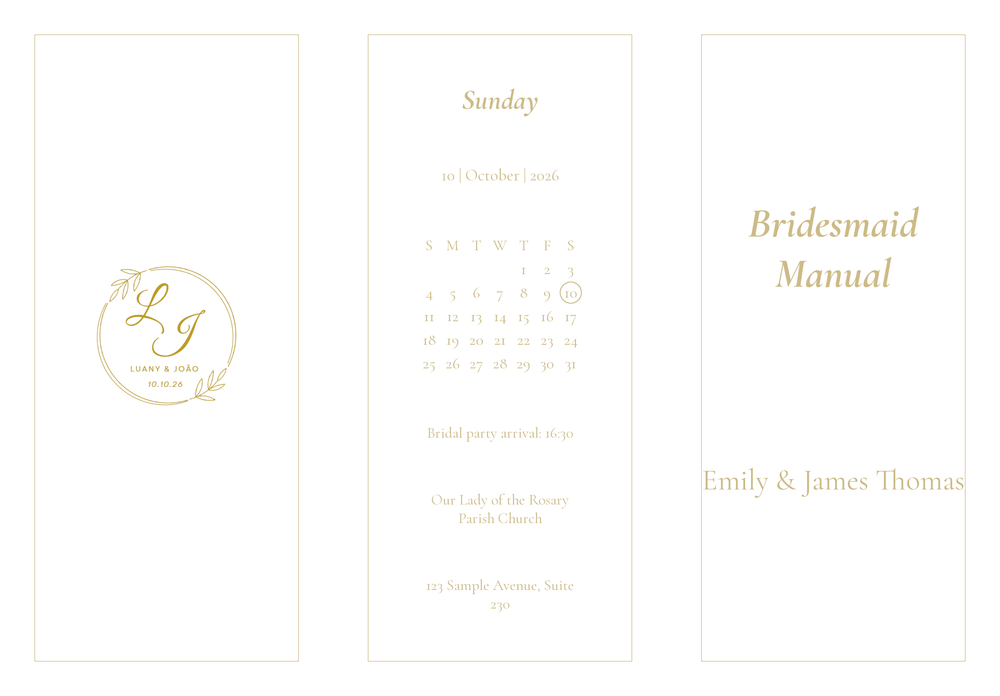
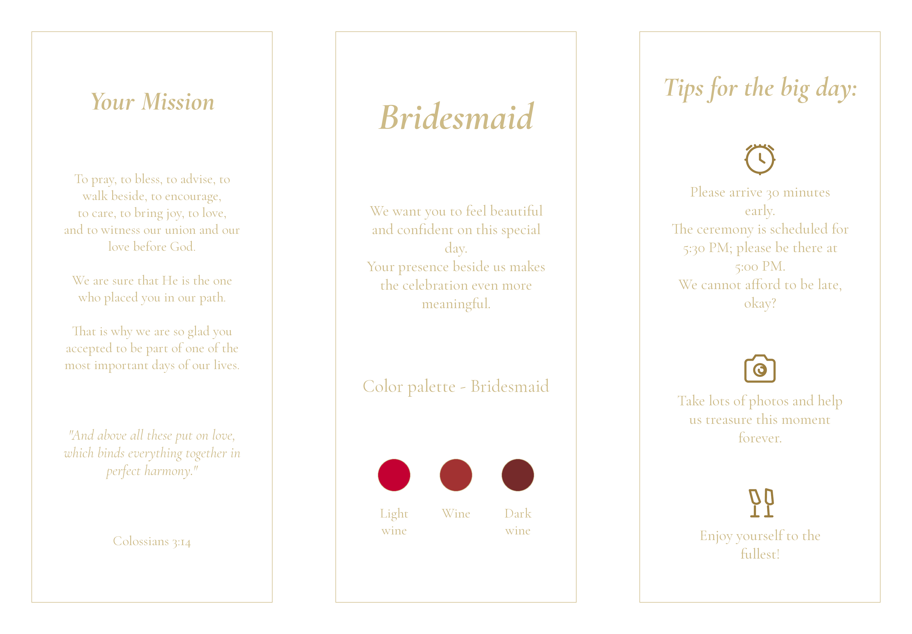

**Groomsman** (`groomsman`):

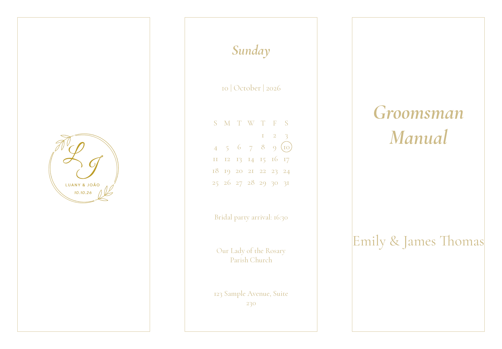
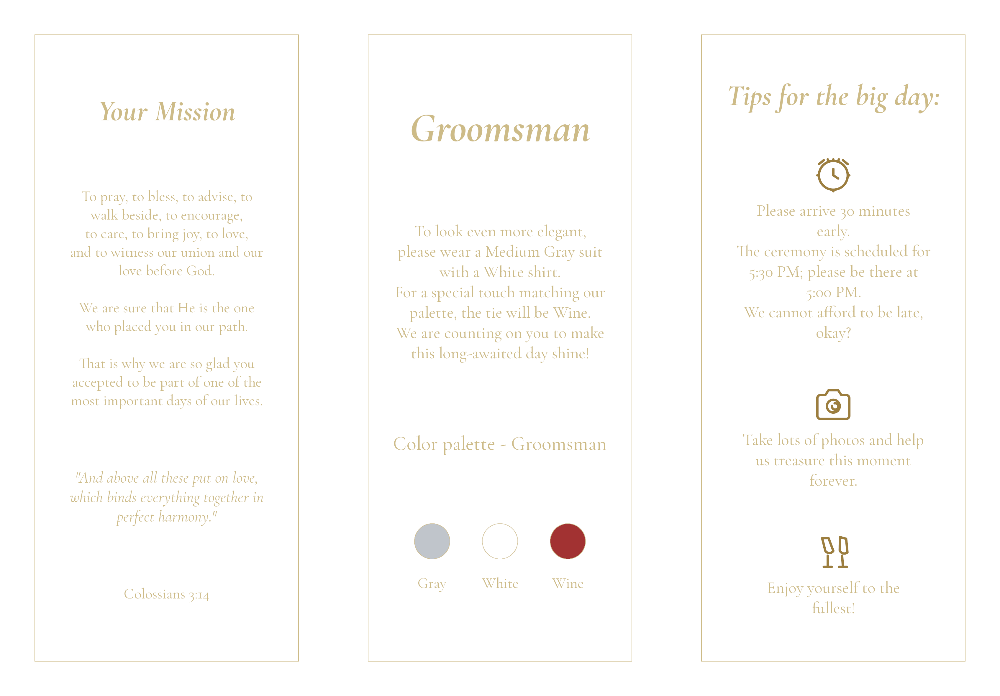

### Junior attendants — `wedding-juniors`

**Page boy** (`pageboy`, with cover illustration):

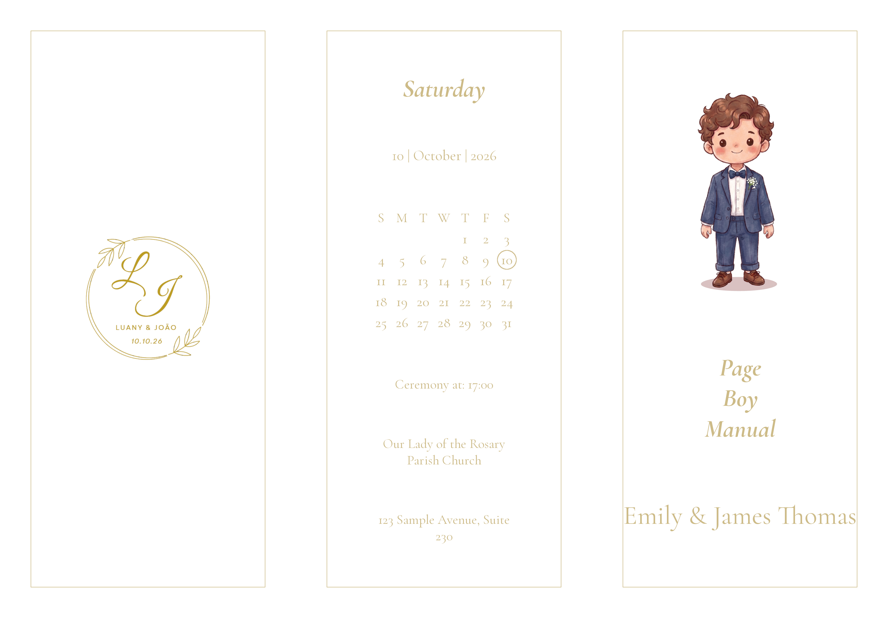
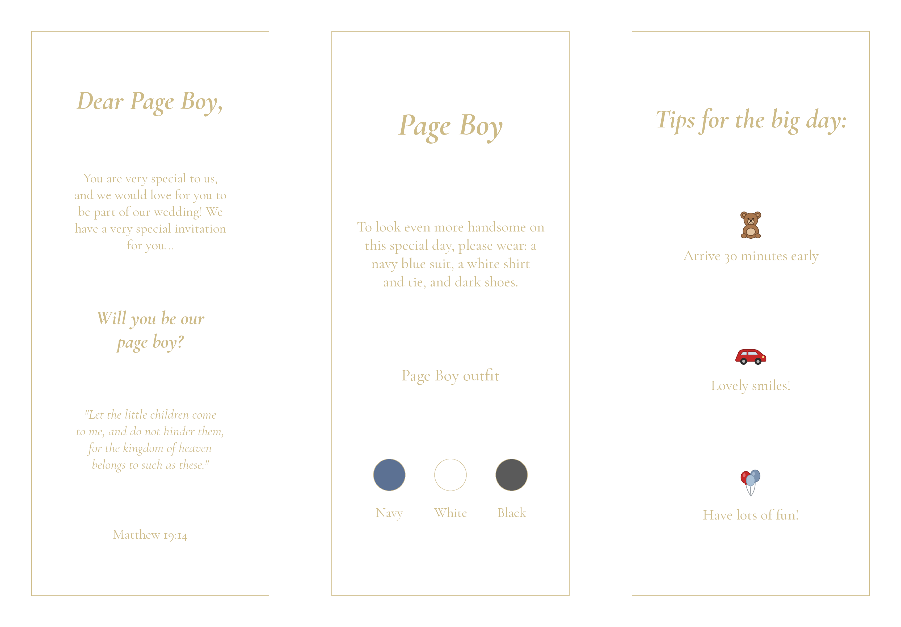

**Flower girl** (`flowergirl`):

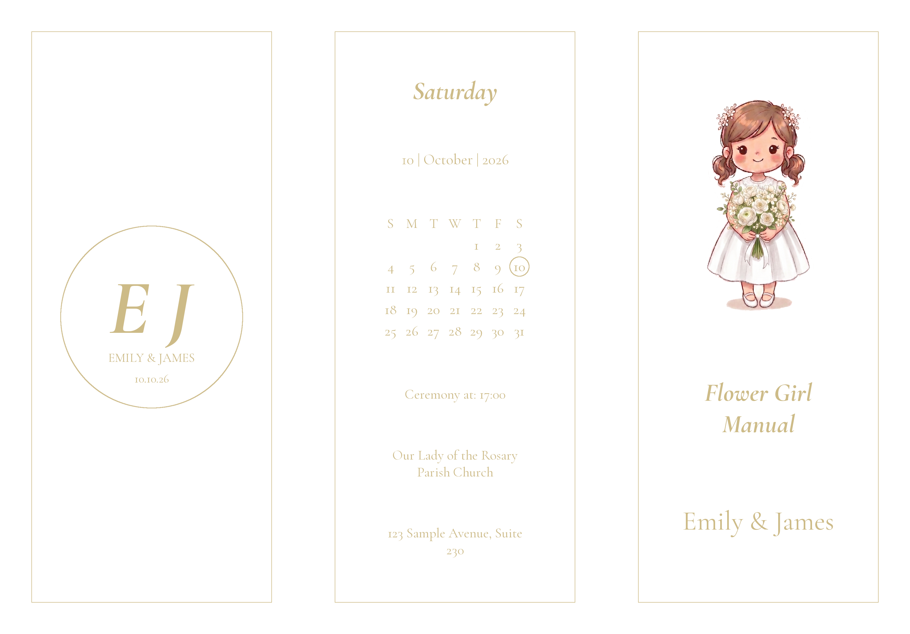
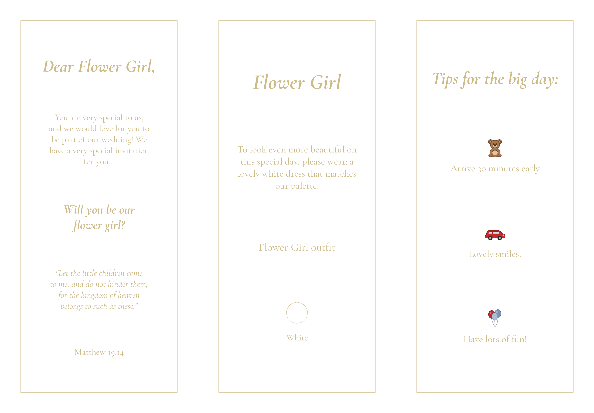

### Single-page invite — `wedding-invite` (5×7")

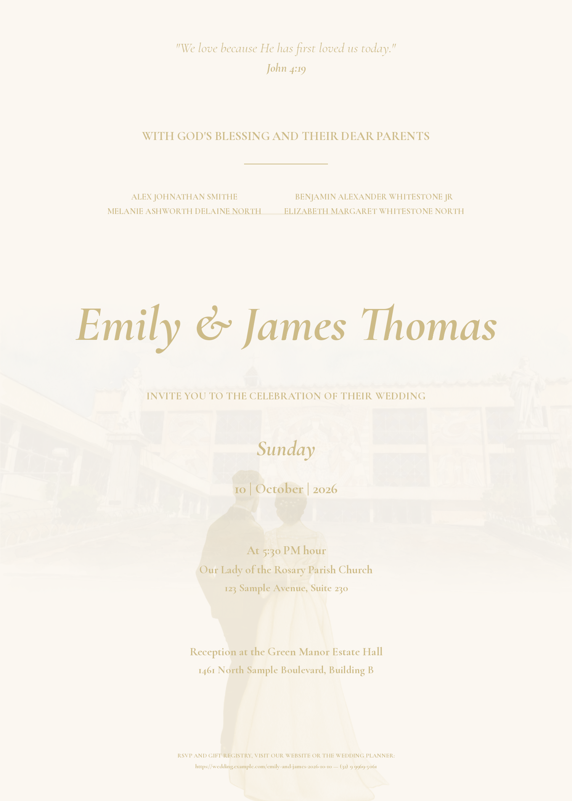

## Requirements

- Windows 11, PowerShell 7
- **GIMP 3.2.4** at `C:\Users\fabri\AppData\Local\Programs\GIMP 3\bin\gimp-console-3.2.exe`
- **Python 3.13** on the system PATH (for `pyyaml`, `questionary`, and `tui.py`)
- The GIMP-embedded Python is invoked separately by `gimp-console-3.2.exe` and only needs the standard library + `gi.repository.Gimp`.

```powershell
# One-time: install the host Python deps used by the TUI
pip install pyyaml questionary
```

`pyyaml` is required; `questionary` is optional (it gives a nicer TUI, falling back to plain `input()` if missing).

## Usage

```powershell
# Interactive run — pick a module, fill in text fields, supply bg image
.\run.ps1

# Build a specific module straight from its content.yaml defaults
.\run.ps1 wedding-invite

# List the known modules and skip the picker
.\run.ps1 -List

# Non-interactive — accept defaults from content.yaml, no prompts
python tui.py --module wedding-invite --run-name my-run --non-interactive

# With a custom background image
python tui.py --module wedding-invite --run-name my-run --bg "C:/path/to/bg.jpg"

# Rebuild EVERY active module in ONE GIMP session (one startup instead of N)
python tui.py --all --non-interactive

# Build only some variants of a module (skips the interactive checklist)
python tui.py --module wedding-juniors --variants pageboy --non-interactive
```

Interactively, after the run name the TUI shows a **checklist** of the module's variants (all ticked by default) so you can build all of them or just a few. To print on **US Letter** instead of A4, set `paper: letter` in the module's `content.yaml` (or change it at the prompt).

Output lands in `modules/<module>/outputs/<run-name>/`:

```
modules/wedding-invite/outputs/my-run/
├── _content.yaml          # exact content used for this run (reproducible)
├── _layout.yaml           # snapshot of layout
├── _content.json          # bridge into GIMP's embedded Python
├── _layout.json
├── wedding-invite.xcf     # editable GIMP source
├── wedding-invite.png     # 300 DPI preview
└── wedding-invite.pdf     # print-ready (native size)
```

Tri-fold modules (`wedding-sponsors`, `wedding-juniors`) additionally emit a print PDF per side, named after the paper — `*_a4.pdf` or `*_letter.pdf`. The leaflet canvas is sized to the chosen paper's **landscape printable area** (sheet − 5 mm on every side @ 300 DPI; A4 ≈ 28.7×20 cm, US Letter ≈ 26.9×20.6 cm), so the print export sits with **equal 5 mm margins on all four sides** and thin fold marks at the thirds — no distortion. Print it at **landscape, scale 100% / actual size** (not "fit to page"). The plain `.pdf` is the same artwork at native size. (Paper geometry in `src/paper.py`, imposition in `src/a4_impose.py`, GIMP render in `src/a4_render.py`, standalone CLI `tools/export_pdf_a4.py`.)

## Customization

Everything text-based is editable per run through the TUI — it walks every leaf field in `content.yaml` and prompts for each (Enter keeps the default): couple names, date, ceremony, tips, and per-variant cover title, invite (`mission`: title / body / highlight / verse) and outfit (`role`: title / body / palette).

A few `content.yaml` knobs adjust the look without touching code:

- `paper` — print sheet, `a4` or `letter` (US); sizes the canvas to that sheet's printable area (tri-fold modules).
- `background_color` — canvas colour (overrides `layout.yaml`).
- `images.logo_pct` / `images.cover_pct` — size of the override art (0–1 of the available area; `1.0` = as large as fits).
- `date.locale` — calendar weekday-header language (`en` / `pt` / `es` / `fr` / `it` / `de`); the day initials are filled automatically.

Image elements are swapped by dropping PNGs into a module's `inputs/` folder (no code edit, no TUI):

- `inputs/logo.png` — back-cover art (overrides the generated initials monogram, which is drawn from the couple's names + date).
- `inputs/background.png` — full-bleed background image.
- `inputs/<variant>.png` — cover illustration (e.g. `inputs/pageboy.png`).

## Project structure

```
gimp-wedding-invite-template/
├── modules/
│   ├── wedding-invite/
│   │   ├── template/          # committed example PNG/PDF/XCF (English placeholders)
│   │   ├── inputs/            # user-supplied bg images (gitignored)
│   │   ├── outputs/<run>/     # PNG + PDF per run (gitignored)
│   │   ├── content.yaml       # text fields, English placeholders
│   │   ├── layout.yaml        # canvas, fonts, block positions
│   │   └── build.py           # run(layout, content, bg_path, output_dir, module_name)
│   ├── wedding-sponsors/    # same shape, tri-fold; 3 variants → 6 XCFs
│   ├── wedding-menu/          # TODO stub (README only)
│   └── wedding-juniors/         # page boy & flower girl, tri-fold; 2 variants → 4 XCFs
├── src/                       # shared GIMP primitives
│   ├── document.py            # canvas + color helpers
│   ├── panels.py              # tri-fold rect math
│   ├── borders.py             # decorative stroke + path
│   ├── text_utils.py          # font resolution + text-layer creation + wrap
│   ├── palette.py             # color-circle row
│   ├── calendar_panel.py      # month grid + day highlight
│   ├── trifold_blocks.py      # shared tri-fold engine (run_variants + panels)
│   ├── paper.py               # A4 / US-Letter geometry (printable area, sheet)
│   ├── a4_impose.py           # pure imposition geometry (no GIMP; unit-tested)
│   ├── a4_render.py           # render artwork onto the chosen paper + fold marks
│   └── module_runner.py       # dispatcher (single module via env, or --all via manifest)
├── tools/                     # standalone utilities (fonts, scraping, export, inspect)
├── assets/                    # backgrounds, ornaments (logo.png, icons/*.svg), palette refs
├── tests/                     # structure / TUI / A4 / e2e
├── tui.py                     # interactive launcher (questionary)
├── run.ps1                    # PowerShell wrapper around tui.py
└── pytest.ini
```

## Adding a new module

1. Copy an existing module: `Copy-Item -Recurse modules/wedding-invite modules/wedding-<your-deliverable>`
2. Edit `layout.yaml` (canvas dimensions, block positions).
3. Edit `content.yaml` (English placeholders).
4. Rewrite `build.py` for the new design.
5. `python tui.py --module wedding-<your-deliverable> --run-name template --non-interactive`
6. Copy the result into `template/template.png` / `.pdf` / `.xcf` and commit.

The module is auto-discovered as long as it has all three of `build.py`, `layout.yaml`, and `content.yaml`.

## Fonts

```powershell
.\tools\install_fonts.ps1
```

Installs **Cormorant Garamond** (regular / bold / italic / bold-italic) from Google Fonts into the user font directory. The build falls back to **Georgia** if Cormorant isn't found.

## Tests

```powershell
pip install pytest

# Static checks only (fast, no GIMP): module structure, YAML, schema, launcher
pytest tests/test_structure.py tests/test_tui.py

# Everything, including end-to-end GIMP builds (slow; auto-skipped if GIMP
# isn't installed — each test launches gimp-console)
pytest
```

`tests/test_e2e.py` builds each module (and `--all`) for real and asserts the XCF/PNG/PDF artifacts exist, plus that a module still builds with an `inputs/logo.png` override present. `tests/test_a4_impose.py` unit-tests the pure A4 imposition geometry without GIMP.

## License

[MIT](LICENSE)
